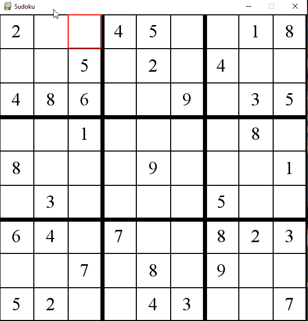

 # Sudoku-Solver
A GUI built using python and the pygame library to play a Sudoku Puzzle. Users can play the game manually by solving the board themselves or have an algorithm solve it for them displaying it in action. 

# Algorithm Used
The algorithm used to solve a Sudoku Puzzle is a simple backtracking algorithm. Info about backtracking algorithms can be found here: https://en.wikipedia.org/wiki/Backtracking A gif below displays the backtracking algorithm in action.

# Manually Solving the Sudoku Puzzle
Users can manually solve the sudoku puzzle if they chose to using their keyboard and mouse. To enter a number in a square, users need to select the square they wish to change and enter a number from 1-9, the number will be displayed in blue to preview the change. To confirm the change, users will need to hit enter and the square will now have the number that was entered.

