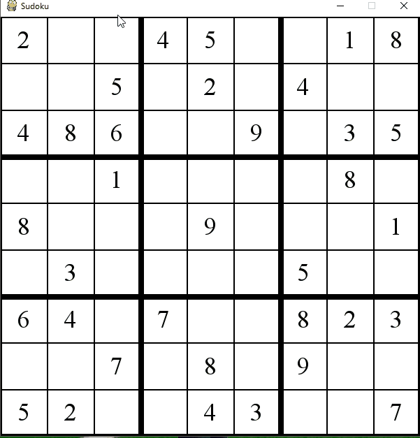

 # Sudoku-Solver
A GUI built using python and the pygame library to play a Sudoku Puzzle. Users can play the game manually by solving the board themselves or have an algorithm solve it for them displaying it in action. 

# Algorithm Used
The algorithm used to solve a Sudoku Puzzle is a simple backtracking algorithm. Info about backtracking algorithms can be found here: https://en.wikipedia.org/wiki/Backtracking A gif below displays the backtracking algorithm in action.

